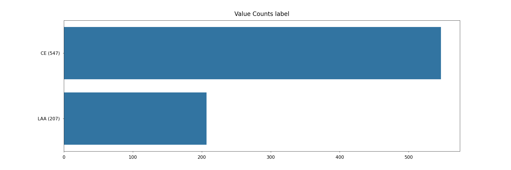

# Mayo Clinic - STRIP AI


## Installation

```
git clone https://github.com/gunesevitan/mayo-clinic-strip-ai.git
cd mayo-clinic-strip-ai
virtualenv --python=/usr/bin/python3.10 venv
source venv/bin/activate
pip install -r requirements.txt
```

You can install internal dataset either manually from https://www.kaggle.com/competitions/mayo-clinic-strip-ai/data or using Kaggle API.
Ensure kaggle.json is in the location `~/.kaggle/kaggle.json` to use the API

```
pip install kaggle
cd data
kaggle competitions download mayo-clinic-strip-ai
unzip mayo-clinic-strip-ai.zip
```

## Project Structure

```
mayo-clinic-strip-ai/
├─ data/
├─ eda/
├─ logs/
├─ models/
├─ src/
│  ├─ torch_modules/
│  ├─ utilities/
├─ venv/
├─ .gitignore
├─ requirements.txt
├─ README.md
```

Internal dataset is inside the data directory.

Data analysis and visualizations are inside the eda directory.

Logs are inside the logs directory.

Pre-trained model weights and model configurations are inside the models directory.

Python modules are inside src directory.

## Software and Hardware

```
Python 3.10.4
Ubuntu 22.04.01 LTS
CPU: AMD Ryzen 9 5950X 16-Core Processor
GPU: NVIDIA GeForce RTX 3090
```

## Dataset

A dataset of instances is pre-computed for training more efficiently.
Pre-computed dataset consist of 16 instances of size 1024x1024 with 3 channels (RGB) per image.
Dataset creation process can be simplified to
* Compress image with JPEG compression (100% JPEG quality)
* Resize longest edge to 20.000 pixels
* Extract non-overlapping instances and pad them with white background
* Sort instances by their sums in descending order and take top 16 instances

Labels of the images are assigned to instances thus the weakly supervised dataset is created.
Labels of the images are either Cardioembolic (CE) or Large Artery Atherosclerosis (LAA).
If an image is CE then all of its instances are assigned with that label and vice versa.



## Models

Multiple Instance Learning (MIL) models are used for processing whole slide image instances.
MIL models take `(batch_size, n_instance, channel, height, width)` shaped inputs and output a probability distribution for two classes.
5-dimensional inputs are converted to 4 dimensions by stacking instances along the batch dimension, so the actual batch size is `batch_size * n_instance`.
This is required for using pre-trained neural networks for feature extraction.
Convolutional and transformer models are used as backbones and extracted features are aggregated on instance level.
Backbones used in the project are listed below.

* DenseNet121 (ImageNet pre-trained weights) - 256x256 16 instances
* DenseNetBlur121d (ImageNet pre-trained weights) - 256x256 16 instances
* DenseNet169 (ImageNet pre-trained weights) - 256x256 16 instances
* DenseNet201 (ImageNet pre-trained weights) - 256x256 16 instances
* EfficientNetB0 (ImageNet pre-trained weights) - 256x256 16 instances
* EfficientNetB1 (ImageNet pre-trained weights) - 256x256 16 instances
* EfficientNetB2 (ImageNet pre-trained weights) - 256x256 16 instances
* EfficientNetB3 (ImageNet pre-trained weights) - 256x256 16 instances
* EfficientNetB4 (ImageNet pre-trained weights) - 256x256 16 instances
* EfficientNetV2 Tiny (ImageNet pre-trained weights) - 256x256 16 instances
* EfficientNetV2 Small (ImageNet pre-trained weights) - 256x256 16 instances
* CoaT Lite Mini (ImageNet pre-trained weights) - 224x224 16 instances
* CoaT Lite Tiny (ImageNet pre-trained weights) - 224x224 16 instances
* CoaT Lite Small (ImageNet pre-trained weights) - 224x224 16 instances
* CaiT XXS 24 (ImageNet pre-trained weights) - 224x224 16 instances
* ConViT Tiny (ImageNet pre-trained weights) - 224x224 16 instances
* ConViT Small (ImageNet pre-trained weights) - 224x224 16 instances
* PiT Tiny (ImageNet pre-trained weights) - 224x224 16 instances
* PoolFormer 24 (ImageNet pre-trained weights) - 224x224 16 instances
* Swin Transformer Tiny Patch 4 Window 7 (ImageNet pre-trained weights) - 224x224 16 instances
* TnT Small Patch 16 (ImageNet pre-trained weights) - 224x224 16 instances

## Validation

5 folds of cross-validation is used as the validation scheme.
Splits are stratified on `binary_encoded_label`, `patient_id` doesn't overlap between folds, and dataset is shuffled before splitting.
Best random seed is selected by minimizing the standard deviation of `binary_encoded_label` mean between folds which ensures target means of folds are close to each other.

## Training
 
**Loss Function**: Negative log likelihood loss is used as the loss function. Binary labels are converted to multi-class labels by simply doing 

```
inputs = torch.sigmoid(inputs)
inputs = torch.cat(((1 - inputs), inputs), dim=-1)
```

**Optimizer**: AdamW with 1e-5 initial learning rate and learning rate is cycled to 1e-6 back-and-forth after every 300 steps.

**Batch Size**: Training: 4 - Validation: 8

**Early Stopping**: Early Stopping is triggered after 5 epochs with no validation loss improvement

## Training Augmentations

* Resize
* Luminosity standardization by 10% chance
* Horizontal flip by 50% chance
* Vertical flip by 50% chance
* Random 90-degree rotation by 25% chance
* Random hue-saturation-value by 25% chance
* Coarse dropout or pixel dropout by 10% chance
* Normalize by instance dataset statistics

## Ensemble

8 models are used in the ensemble. Those models are selected based on their ROC AUC scores.
Models with OOF ROC AUC score greater than 0.65 are qualified for the ensemble.

* DenseNet121 (ImageNet pre-trained weights) - 256x256 16 instances
* DenseNetBlur121d (ImageNet pre-trained weights) - 256x256 16 instances
* DenseNet169 (ImageNet pre-trained weights) - 256x256 16 instances
* EfficientNetB2 (ImageNet pre-trained weights) - 256x256 16 instances
* EfficientNetV2 Tiny (ImageNet pre-trained weights) - 256x256 16 instances
* CoaT Lite Mini (ImageNet pre-trained weights) - 224x224 16 instances
* PoolFormer 24 (ImageNet pre-trained weights) - 224x224 16 instances
* Swin Transformer Tiny Patch 4 Window 7 (ImageNet pre-trained weights) - 224x224 16 instances

Blending is utilized on selected models. Blend weights are found by trial and error.

```
blend_weights = {
    'mil_densenet121_16_256': 0.10,
    'mil_densenet169_16_256': 0.10,
    'mil_densenetblur121d_16_256': 0.25,
    'mil_efficientnetb2_16_256': 0.125,
    'mil_efficientnetv2rwt_16_256': 0.125,
    'mil_coatlitemini_16_224': 0.10,
    'mil_poolformer24_16_224': 0.10,
    'mil_swintinypatch4window7_16_224': 0.10
}
```

Linear stacking is also utilized on selected models by fitting a linear regression model on training predictions and targets.

## Post-processing

Predictions are averaged among patient_id groups and 0.21 is added to aggregated predictions for making the prediction 0.5 centered.
That constant is selected by maximizing the OOF score.

## Results

Quantitative results are provided as cross-validation, public and private leaderboard scores.
Best single model and ensemble cross-validation scores are highlighted.

|                                             | CV ROC AUC | CV Weighted Log Loss | Public Leaderboard | Private Leaderboard |
|---------------------------------------------|------------|----------------------|--------------------|---------------------|
| DenseNet121                                 | 0.6501     |                      |                    |                     |
| DenseNetBlur121d                            | **0.6628** |                      |                    |                     |
| DenseNet169                                 | 0.6551     |                      |                    |                     |
| EfficientNetB2                              | 0.6501     |                      |                    |                     |
| EfficientNetV2 Tiny                         | 0.6500     |                      |                    |                     |
| CoaT Lite Mini                              | 0.6503     |                      |                    |                     |
| PoolFormer 24                               | 0.6536     |                      |                    |                     |
| Swin Transformer Tiny Patch 4 Window 7      | 0.6497     |                      |                    |                     |
| Blend + patient_id Aggregation + Adjustment | 0.6822     | 0.6471               | 0.6                |                     |
| Stack + patient_id Aggregation + Adjustment | **0.6842** | **0.6387**           | 0.6                |                     |